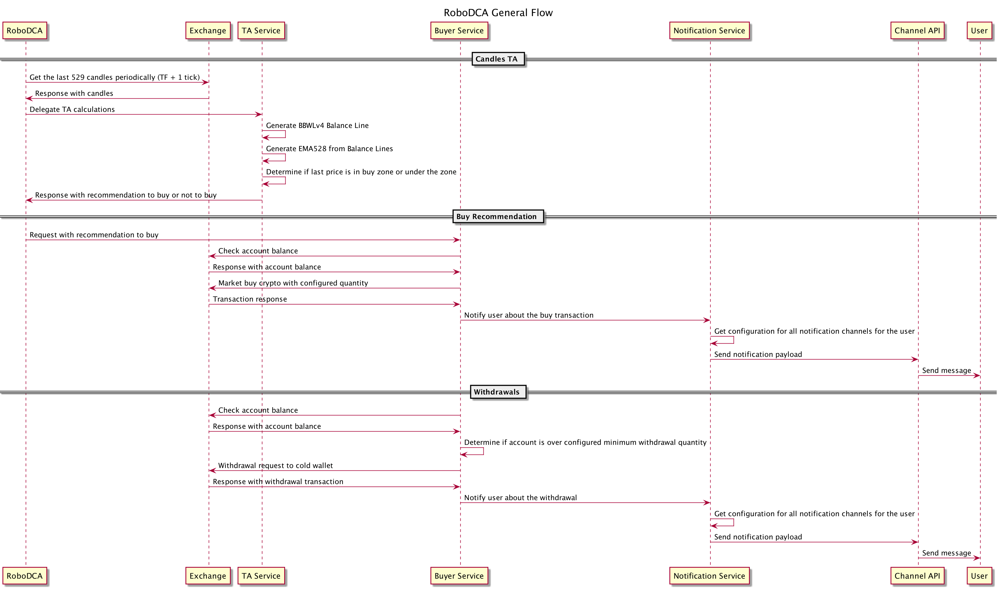
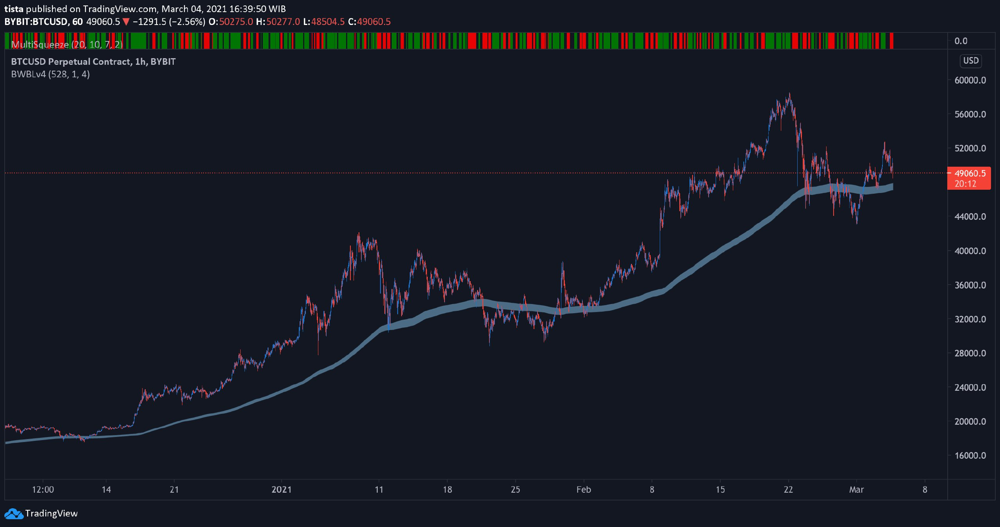

# RoboDCA

RoboDCA is for long term hodlers wanting to automate DCA buyings and withdrawals to a cold wallet. The general flow of the bot can be described by the diagram below.

## Domains

Looking at the diagram, the domains for the bot can be defined below:

* Technical Analysis (TA)
* Buyer
* Withdrawer
* Notifier

Other components are described below:

* `CCXT` - A single client to work with multiple exchanges, link [here](https://github.com/ccxt/ccxt)
* `APScheduler` - Scheduler that is very easy to work with that is async out of the box, link [here](https://apscheduler.readthedocs.io/en/stable/)
* `FastAPI` - HTTP web framework that is async and comes with docs generated for the endpoints, and the venerable Pydantic for request/response modeling, link [here](https://fastapi.tiangolo.com/)

The Technical Analysis domain is built around `APScheduler` while the Buyer and Withdrawer domains are built around `FastAPI`.

### Technical Analysis

The TA will be run periodically according to its configured timeframe. All analysis will be executed +10 second from when the timeframe ends.

The underlying TA strategy is very simple based on [Bill Williams' Balance Lines](https://www.fibolab.com/forex_indicators/bill_williams_balance_line/). There are 2 balance lines which constitutes a zone with upper and lower values. Below is a screenshot of the zone rendered in TradingView using my own custom indicator.

For the keen eye, the zone above looks like a moving average with a higher than usual period. The zone is constructed with EMA528. So far, to be doing DCA, 528 has always been the best number to work with. Some might even say [528 is of angelic nature](https://sacredscribesangelnumbers.blogspot.com/2011/09/angel-number-528.html).

Everytime prices are in the zone or under the zone, it represents a buying opportunity. A stronger buy signal when prices are under the zone.

It is **NOT** the only strategy to DCA, it is the first strategy to be implemented.

### Buyer

This buyer is delegated to always buy as long as there is enough balance in the account. Its only validation check is the user's remaining base currency balance. Ex: Buying Bitcoin from USDT means the configured buying amount must be less than the USDT balance available for the account.

To handle multiple exchanges, RoboDCS uses `CCXT` which will support most crypto exchanges in the world. More about it [here](https://github.com/ccxt/ccxt).

### Withdrawer

The Withdrawer may or may not work across all the exchanges provided by `CCXT`. It depends on the exchange. Some exchanges need an HTTP server somewhere to verify the request. Expect an abstraction to raise an exception if the chosen exchange's withdrawal method is not supported.

### Notifier

Its only job is to send a unidirectional message from RoboDCA to the user. Notification channels supported are:

* Telegram
* Slack
* HTTP

Can be configured to send to more than 1 channel.